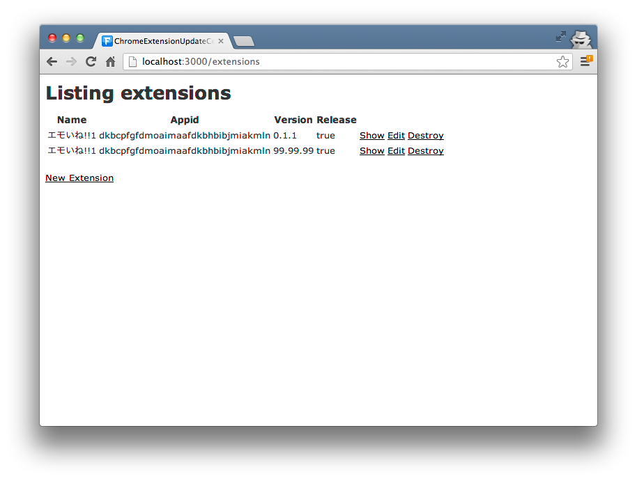
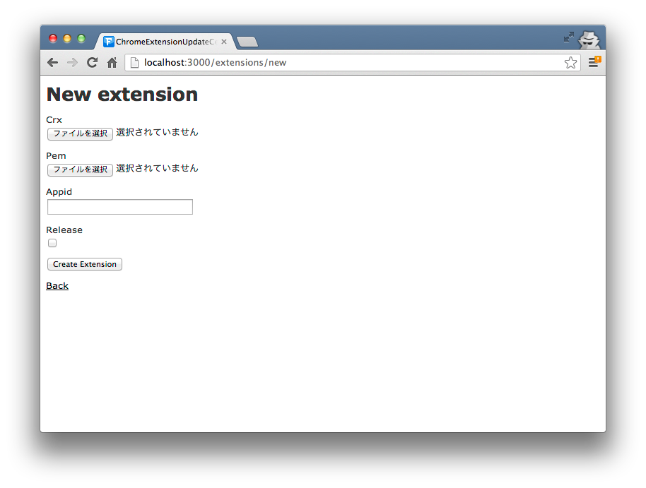
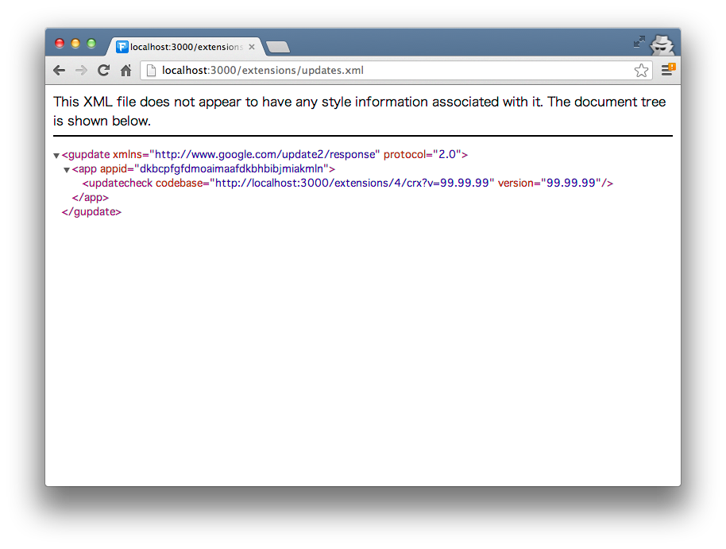

# Chrome Extension Update Center

***Caution! It's yet alpha quality!***

Rails application for self-hosting to your Chrome extension.

## Features

* Easy to use (only uploading `.crx` file and save `appid`)
* Support Google Chrome's [auto update](http://developer.chrome.com/extensions/autoupdate.html)

## See also

* http://developer.chrome.com/extensions/hosting.html
* http://developer.chrome.com/extensions/autoupdate.html
* http://developer.chrome.com/extensions/packaging.html
* http://developer.chrome.com/extensions/crx.html

## Author

Kensuke Nagae <kyanny@gmail.com>
